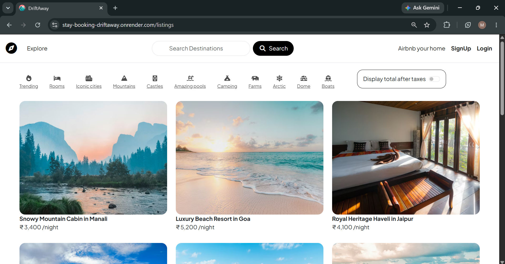
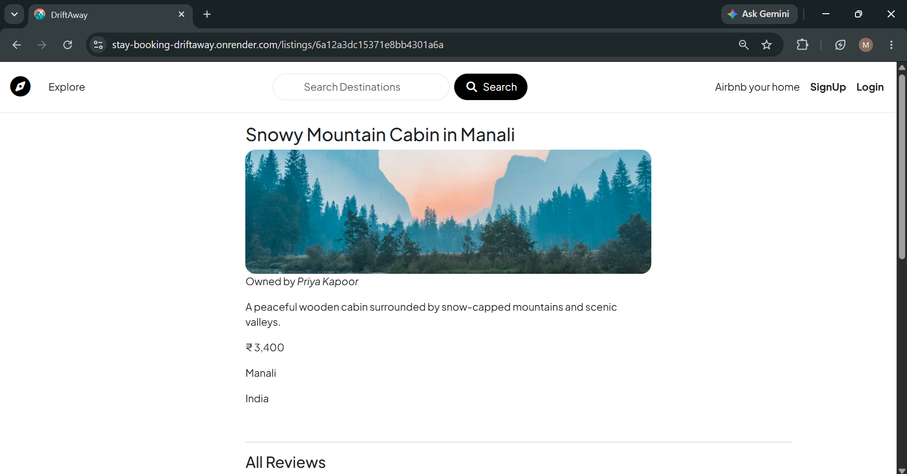
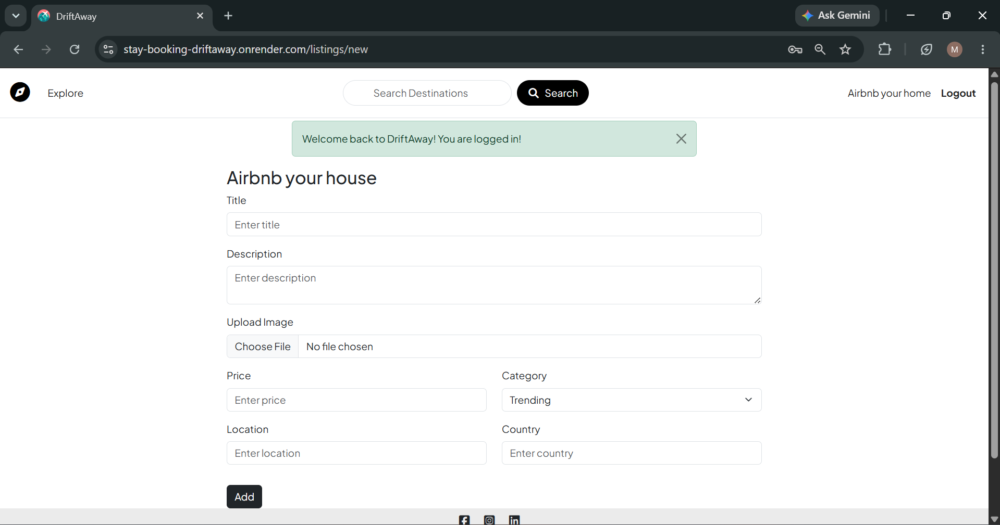
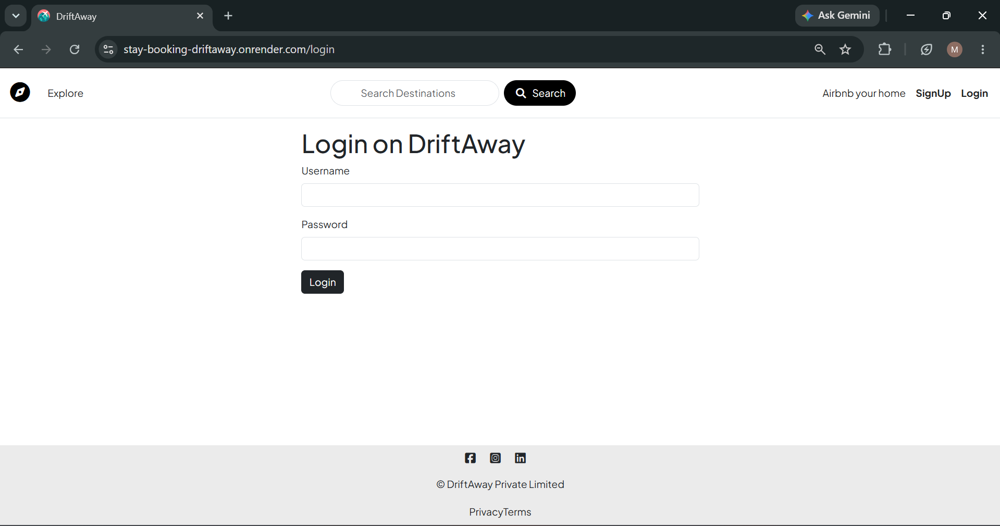
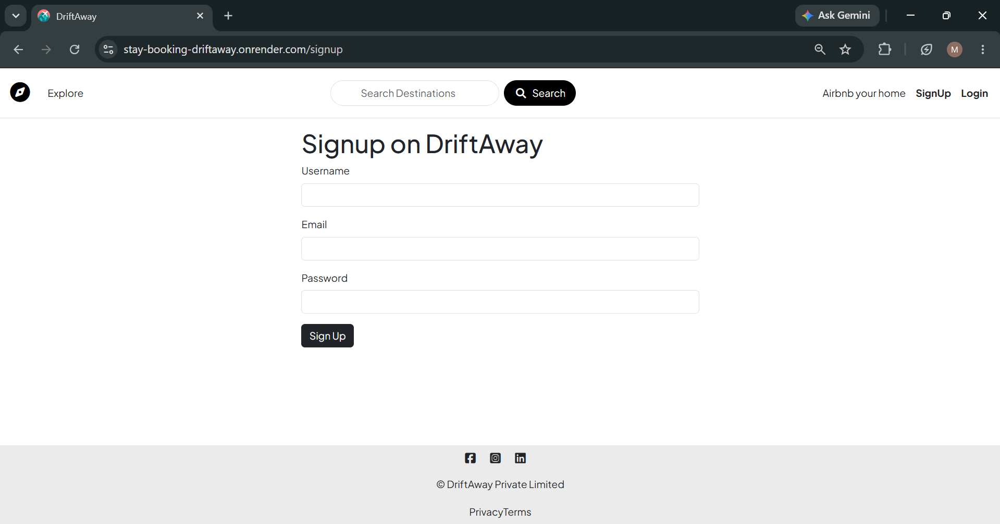
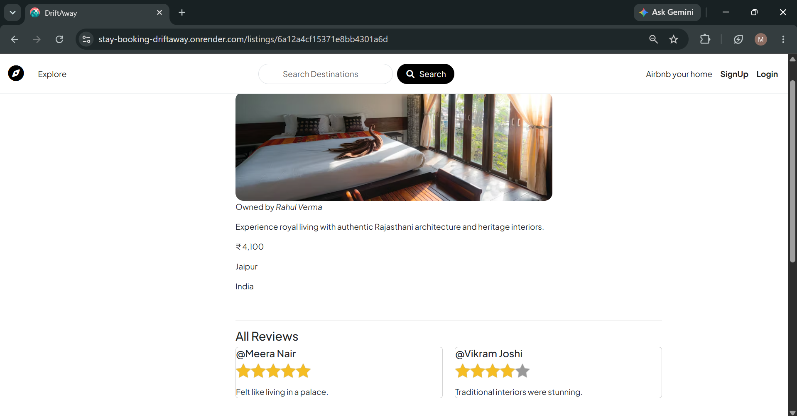
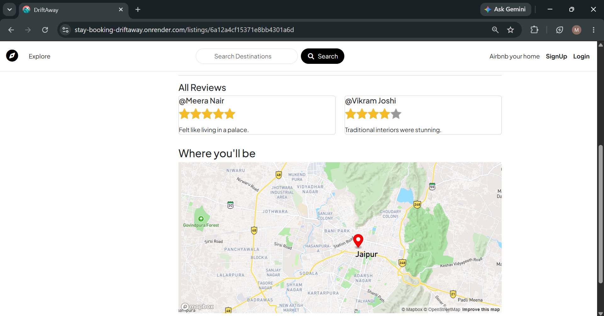

# DriftAway

DriftAway is a full-stack accommodation booking platform that allows users to discover unique stays, create and manage property listings, share reviews, and explore destinations through interactive maps. The platform provides a seamless experience for both travelers and hosts.

## Overview

* Full-Stack Web Application
* User Authentication & Authorization
* CRUD Operations for Listings
* Search Functionality
* Category-Based Filtering
* Reviews & Ratings System
* Cloudinary Image Uploads
* Interactive Maps with Mapbox
* Responsive User Interface
* Deployed on Render

## Live Demo

https://stay-booking-driftaway.onrender.com

---

## Features

### User Authentication

* Secure user registration and login
* Session-based authentication
* Protected routes and authorization

### Property Listings

* Create new listings
* Edit existing listings
* Delete listings
* View detailed property information
* Upload property images

### Search & Categories

* Search destinations by name
* Browse listings using category filters
* Explore different stay categories

### Reviews & Ratings

* Add reviews and ratings
* View feedback from other users
* Star-based rating system

### Maps Integration

* Interactive location maps powered by Mapbox
* Visual representation of listing locations

### Media Management

* Cloud-based image storage using Cloudinary
* Efficient image upload and retrieval

---

## Project Architecture

DriftAway follows the MVC (Model-View-Controller) architecture:

* Models – MongoDB schemas using Mongoose
* Views – EJS templates for dynamic rendering
* Controllers – Business logic and route handling
* Routes – RESTful routing
* Middleware – Authentication, validation, and error handling

---

## Tech Stack

### Frontend

* HTML5
* CSS3
* Bootstrap 5
* EJS

### Backend

* Node.js
* Express.js

### Database

* MongoDB Atlas
* Mongoose

### Authentication

* Passport.js
* Express Session

### Third-Party Services

* Cloudinary
* Mapbox

### Deployment

* Render

---

## Screenshots

### Home Page



### Listing Details



### Create Listing



### Login



### Sign Up



### Reviews & Ratings



### Interactive Maps



---

## Installation

### Clone the Repository

```bash
git clone https://github.com/emokshita/Stay-Booking-Driftaway-.git
cd Stay-Booking-Driftaway-
```

### Install Dependencies

```bash
npm install
```

### Configure Environment Variables

Create a `.env` file in the root directory:

```env
ATLASDB_URL=
SECRET=

CLOUD_NAME=
CLOUD_API_KEY=
CLOUD_API_SECRET=

MAP_TOKEN=
```

### Run the Application

```bash
node app.js
```

Open:

```text
http://localhost:8080
```

---

## Key Learning Outcomes

* Building a complete full-stack web application
* Implementing authentication and authorization
* Working with MongoDB and Mongoose
* Integrating third-party APIs and services
* Managing cloud-based image uploads
* Using geolocation and mapping services
* Applying MVC architecture
* Deploying applications on Render

---

## Future Enhancements

* Wishlist functionality
* User profile dashboard
* Advanced search and filtering
* Booking and reservation system
* Payment gateway integration

---

## Author

**Enukurthi Mokshita**

GitHub: https://github.com/emokshita

LinkedIn: https://www.linkedin.com/in/enukurthi-mokshita
